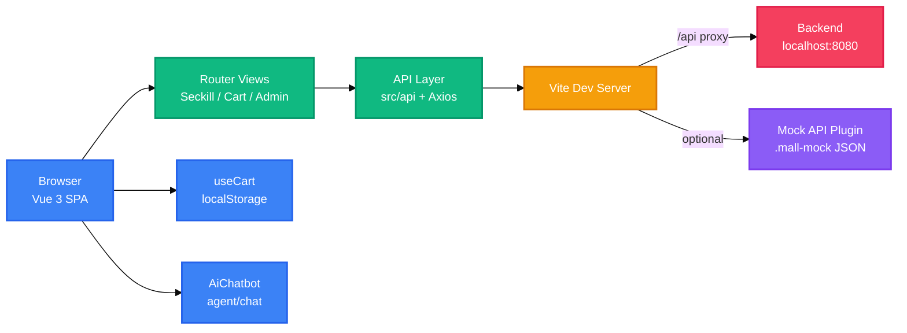

<div align="right">

[English](README.md) · 中文

</div>

<h1 align="center">Mall Seckill Frontend</h1>

<p align="center">
  <strong>基于 Vue 3 的商城秒杀前端，支持登录注册、购物车、后台管理和 AI 客服。</strong>
  <br />
  <em>Vue 3 · Vite · Vue Router · Axios · localStorage</em>
</p>

<p align="center">
  <a href="#快速开始"></a>
</p>

<p align="center">
  
  
  
  
</p>

## 功能特性

| 功能 | 说明 |
|---|---|
| 秒杀会场 | 商品卡片展示秒杀价、原价、剩余库存和实时秒杀状态。 |
| 登录与角色 | 登录注册后 Token 存入 `localStorage`；路由守卫保护购物车和管理页，admin 角色可进入商品管理。 |
| 购物车与结算 | 购物车持久化到 `localStorage`，可刷新库存，并逐件通过 `/api/seckill` 提交订单。 |
| 后台管理 | 商品新增、编辑、删除，支持秒杀价、库存和时间窗口；订单列表可内联更新状态。 |
| AI 客服 | 悬浮聊天窗向 `agent/chat` 发送消息，使用 `mall_user` 中的用户 ID。 |
| 开发 Mock | 可选的 Vite 中间件从 `.mall-mock` JSON 文件提供认证、商品、订单和秒杀接口。 |

## 快速开始

### 环境要求

- Node.js 与 npm
- 后端服务位于 `http://localhost:8080`，或启用内置 Mock 接口

### 安装

```bash
npm install
```

### 启动

```bash
npm run dev
```

### 构建

```bash
npm run build
npm run preview
```

## 使用示例

### 开发服务器

运行 `npm run dev` 后，Vite 默认在 `http://localhost:5173` 提供页面。

### 启用 Mock

打开 `vite.config.js`，取消 `mallMockApiPlugin()` 的注释即可在没有后端的情况下运行。

```js
export default defineConfig({
  plugins: [
    vue(),
    mallMockApiPlugin()
  ],
})
```

### 配置后端

`/api` 请求默认代理到 `http://localhost:8080`。当前端与后端分开部署时，可通过环境变量设置 `VITE_API_BASE_URL`：

```bash
VITE_API_BASE_URL=http://localhost:8080
```

### 登录抢购

启用 Mock 后，任意非空用户名和密码都可以登录；用户名为 `admin` 时视为管理员。登录后即可在秒杀页抢购或加入购物车。

## 系统架构

应用是 Vue SPA，通过 Axios API 层访问后端，并带有仅用于开发的 Mock 中间件。



## 配置

配置分布在 `vite.config.js` 和应用代码中。

| 配置项 | 说明 | 默认值 |
|---|---|---|
| `VITE_API_BASE_URL` | Axios 基础地址 | `''` |
| `server.proxy['/api'].target` | 后端代理地址 | `http://localhost:8080` |
| `mallMockApiPlugin()` | 开发 Mock 中间件 | 未启用（已注释） |
| `.mall-mock/products.json` | Mock 商品数据 | 内置种子商品 |
| `.mall-mock/orders.json` | Mock 订单数据 | 下单时生成 |
| `localStorage.mall_token` | 登录 Token | 登录后写入 |
| `localStorage.mall_user` / `role` | 用户信息与角色 | 登录后写入 |
| `localStorage.mall_cart` | 购物车数据 | 空 |

## API

API 模块位于 `src/api`。启用 Mock 插件后，以下接口均可直接使用。

### 认证

| 方法 | 路径 | 说明 |
|---|---|---|
| POST | `/api/auth/login` | 登录并获取 Token |
| POST | `/api/auth/register` | 注册新用户 |
| GET | `/api/auth/me` | 当前用户信息（Bearer Token） |

### 商品

| 方法 | 路径 | 说明 |
|---|---|---|
| GET | `/api/products` | 商品列表 |
| POST | `/api/products` | 新增商品 |
| PUT | `/api/products/{id}` | 修改商品 |
| DELETE | `/api/products/{id}` | 删除商品 |
| GET | `/api/products/{id}/stock` | 查询商品库存 |

### 订单

| 方法 | 路径 | 说明 |
|---|---|---|
| GET | `/api/orders` | 订单列表 |
| PATCH | `/api/orders/{id}/status` | 更新订单状态 |

### 秒杀与 Agent

| 方法 | 路径 | 说明 |
|---|---|---|
| POST | `/api/seckill` | 创建秒杀订单 |
| POST | `/agent/chat` | 向 AI 客服发送消息 |

## 项目结构

```
mall-seckill-frontend/
├── index.html
├── package.json
├── vite.config.js
├── vite-plugin-mall-mock.js
├── vite-plugin-register-module.js
├── public/                  # 静态资源
├── modules/register/        # 可选注册模块
├── .mall-mock/              # 开发 Mock 数据
└── src/
    ├── main.js
    ├── App.vue
    ├── api/                 # Axios API 模块
    ├── assets/              # 图片与图标
    ├── components/          # AiChatbot
    ├── composables/         # useCart
    ├── router/              # 路由与守卫
    └── views/               # 秒杀页、购物车、注册、后台
```

## 技术栈

| 技术 | 用途 |
|---|---|
| Vue 3.5 | UI 框架 |
| Vite 5.4 | 开发服务器与构建工具 |
| Vue Router 4.5 | 路由与路由守卫 |
| Axios 1.7 | HTTP 客户端 |
| 自定义 CSS | 主题、布局和组件样式 |
| localStorage | Token、用户、角色与购物车持久化 |
| Vite Mock 插件 | 开发用 REST API 与注册模块 |

## 贡献指南

1. Fork 仓库
2. 创建功能分支（`git checkout -b feature/your-feature`）
3. 提交修改（`git commit -m 'feat: add your feature'`）
4. 推送分支（`git push origin feature/your-feature`）
5. 提交 Pull Request

---

未检测到 LICENSE 文件。建议添加 LICENSE 以明确项目授权。

<!-- BEAUTIFIED -->
