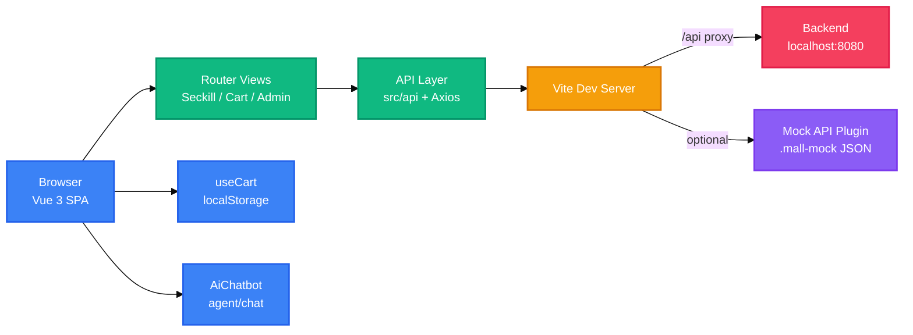

<div align="right">

[English](README.md) · [中文](README-zh.md)

</div>

<h1 align="center">Mall Seckill Frontend</h1>

<p align="center">
  <strong>Vue 3 storefront for seckill shopping with login, cart, admin management, and an AI assistant.</strong>
  <br />
  <em>Vue 3 · Vite · Vue Router · Axios · localStorage</em>
</p>

<p align="center">
  <a href="#quick-start"></a>
</p>

<p align="center">
  
  
  
  
</p>

## Features

| Feature | Description |
|---|---|
| Seckill storefront | Product cards show seckill price, original price, remaining stock, and live seckill window status. |
| Auth and roles | Login and register store a token in `localStorage`; route guards protect cart and admin pages, and the admin role unlocks product management. |
| Cart and checkout | The cart persists in `localStorage`, refreshes stock, and submits each item through `/api/seckill`. |
| Admin console | Product CRUD with seckill price, stock, and time window; order list with inline status updates. |
| AI chatbot | A floating assistant posts messages to `agent/chat` and uses the logged-in user id from `mall_user`. |
| Dev mock API | An optional Vite middleware serves auth, products, orders, and seckill endpoints from `.mall-mock` JSON files. |

## Quick Start

### Prerequisites

- Node.js and npm
- Backend at `http://localhost:8080`, or the built-in mock API enabled

### Install

```bash
npm install
```

### Run

```bash
npm run dev
```

### Build

```bash
npm run build
npm run preview
```

## Usage

### Dev Server

`npm run dev` starts Vite and serves the app at the default URL `http://localhost:5173`.

### Enable Mock API

Open `vite.config.js` and uncomment `mallMockApiPlugin()` to run the app without a backend.

```js
export default defineConfig({
  plugins: [
    vue(),
    mallMockApiPlugin()
  ],
})
```

### Configure Backend

Requests under `/api` are proxied to `http://localhost:8080`. When the frontend is served separately from the backend, set `VITE_API_BASE_URL` in the environment:

```bash
VITE_API_BASE_URL=http://localhost:8080
```

### Login and Buy

With the mock API enabled, any non-empty username and password can log in. The username `admin` is treated as the admin role. After login, use the seckill page to buy or add products to the cart.

## Architecture

The app is a Vue SPA that talks to a backend through an Axios API layer, with an optional dev-only mock middleware.



## Configuration

Configuration is spread between `vite.config.js` and the app code.

| Key | Description | Default |
|---|---|---|
| `VITE_API_BASE_URL` | Axios base URL | `''` |
| `server.proxy['/api'].target` | Backend proxy target | `http://localhost:8080` |
| `mallMockApiPlugin()` | Dev mock middleware | disabled (commented) |
| `.mall-mock/products.json` | Mock product data | built-in seed products |
| `.mall-mock/orders.json` | Mock order data | created on purchase |
| `localStorage.mall_token` | Auth token | set after login |
| `localStorage.mall_user` / `role` | User profile and role | set after login |
| `localStorage.mall_cart` | Cart items | empty |

## API

The API layer is in `src/api`. All endpoints are available from the mock plugin when it is enabled.

### Auth

| Method | Path | Description |
|---|---|---|
| POST | `/api/auth/login` | Login and receive a token |
| POST | `/api/auth/register` | Register a new user |
| GET | `/api/auth/me` | Current user profile (Bearer token) |

### Products

| Method | Path | Description |
|---|---|---|
| GET | `/api/products` | List products |
| POST | `/api/products` | Create a product |
| PUT | `/api/products/{id}` | Update a product |
| DELETE | `/api/products/{id}` | Delete a product |
| GET | `/api/products/{id}/stock` | Query product stock |

### Orders

| Method | Path | Description |
|---|---|---|
| GET | `/api/orders` | List orders |
| PATCH | `/api/orders/{id}/status` | Update order status |

### Seckill and Agent

| Method | Path | Description |
|---|---|---|
| POST | `/api/seckill` | Create a seckill order |
| POST | `/agent/chat` | Send a message to the AI assistant |

## Project Structure

```
mall-seckill-frontend/
├── index.html
├── package.json
├── vite.config.js
├── vite-plugin-mall-mock.js
├── vite-plugin-register-module.js
├── public/                  # static assets
├── modules/register/        # optional register module
├── .mall-mock/              # dev mock data
└── src/
    ├── main.js
    ├── App.vue
    ├── api/                 # Axios API modules
    ├── assets/              # images and icons
    ├── components/          # AiChatbot
    ├── composables/         # useCart
    ├── router/              # routes and guards
    └── views/               # SeckillShop, Cart, Register, Admin
```

## Tech Stack

| Technology | Purpose |
|---|---|
| Vue 3.5 | UI framework |
| Vite 5.4 | Dev server and build tool |
| Vue Router 4.5 | Routing and route guards |
| Axios 1.7 | HTTP client |
| Custom CSS | Theme, layout, and components |
| localStorage | Token, user, role, and cart persistence |
| Vite mock plugins | Dev-only REST API and register module |

## Contributing

1. Fork the repository
2. Create a feature branch (`git checkout -b feature/your-feature`)
3. Commit your changes (`git commit -m 'feat: add your feature'`)
4. Push to the branch (`git push origin feature/your-feature`)
5. Open a Pull Request

---

No LICENSE file detected. Add a LICENSE to clarify project licensing.

<!-- BEAUTIFIED -->
